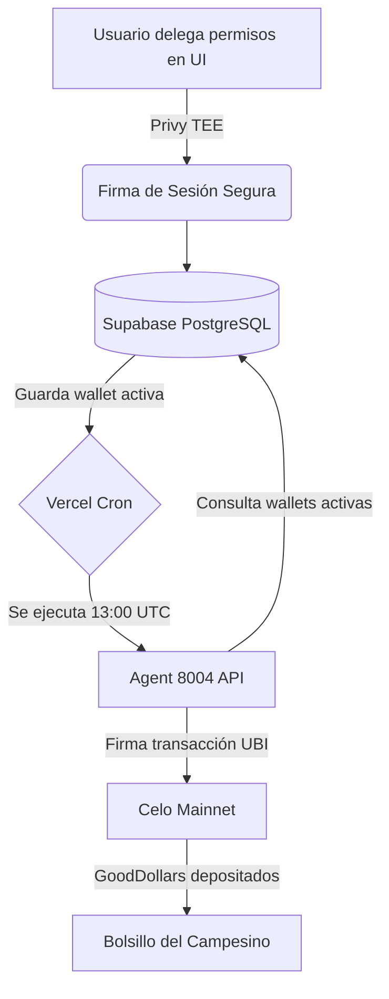
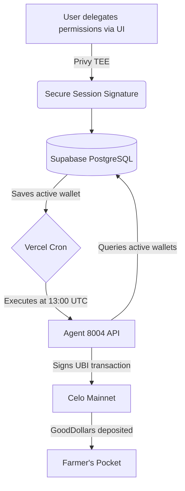

# 🌿 Biota Protocol

**Ecosistema Autónomo de Finanzas Regenerativas (ReFi) y Economía Phygital en Celo.**

Biota Protocol es una infraestructura Web3 "invisible" diseñada para empoderar a productores rurales y artesanos. Al orquestar contratos inteligentes, flujos de capital continuo y agentes de Inteligencia Artificial, el protocolo transforma la salud del suelo y el trabajo artesanal en activos digitales, garantizando un ecosistema financiero autosustentable sin la fricción tradicional de la blockchain.

## 🧬 Arquitectura del Sistema: Dual-Wallet

El protocolo opera bajo una arquitectura de **Doble Bolsillo (Dual-Wallet)** integrada nativamente en el cliente web:

1. **Bolsillo Operativo (Privy/Wagmi):** Billetera integrada (abstracta) para la interacción diaria, optimizada para MiniPay. Gestiona compras en el mercado, sellos digitales y transacciones sin requerir frases semilla.
2. **Bolsillo de Impacto (Universal Provider):** Conexión no intrusiva vía WalletConnect con GoodWallet para la gestión exclusiva del Ingreso Básico Universal (UBI) y los flujos de Superfluid.

## 🤖 Sistema Multi-Agente y Core Lógico

El ecosistema está impulsado por agentes de IA que operan on-chain sobre **Celo Mainnet** (Chain ID: 42220):

- **Agent 8004 (UBI Auto-Claim Operator):** Un agente autónomo que opera 24/7 en la nube. Reclama automáticamente el Ingreso Básico Universal (UBI) diario para los agricultores, garantizando su rentabilidad sin necesidad de que abran la aplicación.
- **Agent Cajero (x402 Merchant):** Gestiona micropagos y retiene fondos en contratos Escrow. Distribuye valor a través del `BIOTA_SPLITTER` usando un mecanismo de "Double Trigger" (Aprobación Comunitaria + Verificación IA).
- **Agent Vigil / Civil+ (Security Sentinel):** Monitor preventivo de ciberseguridad. Audita permisos ERC-20 (`allowances`) y vigila actualizaciones de contratos Proxy (EIP-1967) para proteger las billeteras contra colisiones de almacenamiento y vulnerabilidades.
- **Orquestador de Diagnóstico:** IA multimodal especializada en lectura de cromatografías y análisis microbiológico para certificar la regeneración del suelo.

## 🕰️ Arquitectura Invisible Web3 (El Despertador ReFi)

Biota Protocol implementa un ciclo técnico automatizado para eliminar la fricción del usuario (gas y operaciones manuales):



1. **Delegación TEE (Privy):** El usuario otorga permisos una sola vez mediante llaves de sesión (Session Keys) aseguradas en un Entorno de Ejecución Confiable.
2. **Persistencia (Supabase):** La billetera del usuario se registra en una "Lista Maestra" (PostgreSQL) con un estado activo.
3. **Cron Mundial (Vercel):** Un trigger automatizado despierta a la API diariamente a las 13:00 UTC (1 hora después del reinicio del contrato de GoodDollar).
4. **Ejecución On-Chain (Viem/Celo):** El Agente lee la base de datos y firma las transacciones pagando el gas (Gas Sponsoring), inyectando el UBI directamente a la billetera del campesino.

## ⚙️ Flujo Financiero y Tokenización

La DApp descentraliza y automatiza el acceso al capital:

- **BiotaPass (NFT Dinámico):** Un pasaporte biológico on-chain que evoluciona a medida que mejora el Bio-Score del suelo o la reputación del artesano.
- **Claim Nativo & Automático:** El reclamo del pool diario de GoodDollar (`UBI_SCHEME`) se ejecuta 100% en backend (vía Agente 8004) o frontend, eliminando redirecciones externas.
- **Money Streaming:** El UBI reclamado alimenta flujos constantes (`CFA_V1_FORWARDER` de Superfluid) para garantizar un "Salario Regenerativo" continuo para la comunidad.
- **Proof of Action (PoA):** Certificación geográfica y temporal de labores agrícolas y productivas.

## 🛠️ Stack Tecnológico

- **Frontend / Backend:** Next.js 15 (App Router) + Tailwind CSS. Optimizado para Telegram Mini Apps (TWA).
- **Web3 Core:** Viem, Wagmi, Privy, Thirdweb.
- **Base de Datos & Cron:** Supabase (PostgreSQL) y Vercel Cron Jobs.
- **Smart Contracts:** Solidity, Proxies UUPS.
- **Protocolos DeFi:** Superfluid (Streaming), GoodDollar (UBI).
- **Inteligencia Artificial:** Google Gen AI SDK (Gemini-flash-latest / 1.5 Pro).

## 🔒 Privacidad y Propiedad Intelectual

Para proteger el conocimiento ancestral y técnico de los productores:

- La lógica de análisis de cromatogramas y las fórmulas exactas de bioinsumos operan estrictamente en el entorno Server-Side.
- Las firmas de transacciones delegadas por los agentes utilizan variables de entorno fuertemente aisladas mediante Privy Server-Auth TEE.

## 📦 Despliegue Local

1. **Clonar el repositorio:**
   ```bash
   git clone https://github.com/daniel5312/agent_biotaRegenerativo.git
   ```

2. **Instalar dependencias:**
   ```bash
   npm install
   ```

3. **Variables de Entorno:** Copiar `.env.example` a `.env.local` y configurar las llaves correspondientes (Privy, Supabase, Gemini, RPCs, CRON_SECRET).

4. **Ejecutar servidor de desarrollo:**
   ```bash
   npm run dev
   ```

Hecho con ❤️ en Envigado, Antioquia, para el ecosistema ReFi global.

---

ENGLISH:

# 🌿 Biota Protocol

**Autonomous Regenerative Finance (ReFi) and Phygital Economy Ecosystem on Celo.**

Biota Protocol is an "invisible" Web3 infrastructure designed to empower rural producers and artisans. By orchestrating smart contracts, continuous capital streams, and Artificial Intelligence agents, the protocol transforms soil health and artisanal labor into digital assets, ensuring a self-sustaining financial ecosystem without the traditional friction of blockchain technology.

## 🧬 System Architecture: Dual-Wallet

The protocol operates under a **Dual-Wallet** architecture integrated natively into the web client:

1. **Operational Pocket (Privy/Wagmi):** An embedded abstract wallet for daily interactions, optimized for MiniPay. It manages marketplace purchases, digital stamps, and transactions without requiring seed phrases.
2. **Impact Pocket (Universal Provider):** A non-intrusive connection via WalletConnect with GoodWallet, exclusively managing the Universal Basic Income (UBI) and Superfluid streams.

## 🤖 Multi-Agent System and Core Logic

The ecosystem is powered by AI agents operating on-chain over **Celo Mainnet** (Chain ID: 42220):

- **Agent 8004 (UBI Auto-Claim Operator):** An autonomous agent operating 24/7 in the cloud. It automatically claims the daily Universal Basic Income (UBI) for farmers, guaranteeing profitability without them ever needing to open the app.
- **Cashier Agent (x402 Merchant):** Manages micropayments and holds funds in Escrow contracts. It distributes value through the `BIOTA_SPLITTER` using a "Double Trigger" mechanism (Community Approval + AI Verification).
- **Vigil / Civil+ Agent (Security Sentinel):** Preventive cybersecurity monitor. It audits ERC-20 permissions (`allowances`) and tracks Proxy contract updates (EIP-1967) to protect wallets against storage collisions and vulnerabilities.
- **Diagnostic Orchestrator:** Multimodal AI specialized in reading chromatograms and microbiological analysis to certify soil regeneration.

## 🕰️ Invisible Web3 Architecture (The ReFi Alarm Clock)

Biota Protocol implements an automated technical cycle to eliminate user friction (gas and manual operations):



1. **TEE Delegation (Privy):** The user grants permissions once via Session Keys secured in a Trusted Execution Environment.
2. **Persistence (Supabase):** The user's wallet is registered in a "Master List" (PostgreSQL) with an active status.
3. **Global Cron (Vercel):** An automated trigger wakes the API daily at 13:00 UTC (1 hour after the GoodDollar contract resets).
4. **On-Chain Execution (Viem/Celo):** The Agent reads the database and signs transactions by paying the gas (Gas Sponsoring), injecting the UBI directly into the farmer's wallet.

## ⚙️ Financial Flow and Tokenization

The DApp decentralizes and automates capital access:

- **BiotaPass (Dynamic NFT):** An on-chain biological passport that evolves as the soil's Bio-Score or the artisan's reputation improves.
- **Native & Automated Claim:** The daily GoodDollar pool claim (`UBI_SCHEME`) is executed 100% in the backend (via Agent 8004) or frontend, eliminating external redirections.
- **Money Streaming:** The claimed UBI feeds constant flows (`CFA_V1_FORWARDER` from Superfluid) to guarantee a continuous "Regenerative Salary" for the community.
- **Proof of Action (PoA):** Geographic and temporal certification of agricultural and productive labor.

## 🛠️ Tech Stack

- **Frontend / Backend:** Next.js 15 (App Router) + Tailwind CSS. Optimized for Telegram Mini Apps (TWA).
- **Web3 Core:** Viem, Wagmi, Privy, Thirdweb.
- **Database & Cron:** Supabase (PostgreSQL) and Vercel Cron Jobs.
- **Smart Contracts:** Solidity, UUPS Proxies.
- **DeFi Protocols:** Superfluid (Streaming), GoodDollar (UBI).
- **Artificial Intelligence:** Google Gen AI SDK (Gemini-flash-latest / 1.5 Pro).

## 🔒 Privacy and Intellectual Property

To protect the ancestral and technical knowledge of the producers:

- The chromatogram analysis logic and exact bio-input formulas operate strictly in a Server-Side environment.
- Delegated transaction signatures by agents use tightly isolated environment variables via Privy Server-Auth TEE.

## 📦 Local Deployment

1. **Clone the repository:**
   ```bash
   git clone https://github.com/daniel5312/agent_biotaRegenerativo.git
   ```

2. **Install dependencies:**
   ```bash
   npm install
   ```

3. **Environment Variables:** Copy `.env.example` to `.env.local` and configure the corresponding keys (Privy, Supabase, Gemini, RPCs, CRON_SECRET).

4. **Run development server:**
   ```bash
   npm run dev
   ```

Made with ❤️ in Envigado, Antioquia, for the global ReFi ecosystem.
